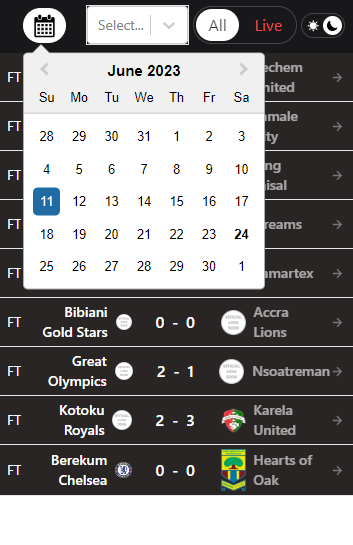

# Live Score App

This is a live score app built with Next.js and React, powered by the allsportsapi.com API. It provides real-time updates and information about various sports events.

## Demo

[foootscore.vercel.app](https://foootscore.vercel.app/)

## Features

- Live scores for football.
- Match details including teams, scores, statistics and lineups.
- Ability to filter by date.

## Technologies Used

- Next.js: A React framework for server-side rendering and building web applications.
- React: A JavaScript library for building user interfaces.
- allsportsapi.com API: An API service providing sports data and live scores.

## Installation

1. Clone the repository: ```git clone https://github.com/anas919/foootscore```
2. Navigate to the project directory: ```cd foootscore```
3. Install the dependencies: ```npm install```

## Configuration

To use the allsportsapi.com API, you need to obtain an API key. Follow these steps to set up your API key:

1. Visit [allsportsapi.com](https://allsportsapi.com/) and sign up for an account.
2. Generate an API key from your account dashboard.
3. Create a ```.env``` file in the root of the project.
4. Add your API key to the ```.env``` file: ```API_KEY="your-api-key"```

## Usage

1. Start the development server: ```npm run dev```
2. Open your web browser and visit: `http://localhost:3000`

## Demo

1. Fixtures


2. Fixtures Dark Mode


3. Fixture Details


4. Fixture Details Dark Mode


5. Fixture Details Lineups


6. Fixtures Small Screens


7. Fixtures Small Screens Dark Mode



## Contributing

Contributions are welcome! If you find any issues or have suggestions for improvements, please open an issue or submit a pull request.

## License

This project is licensed under the [MIT License](LICENSE).
